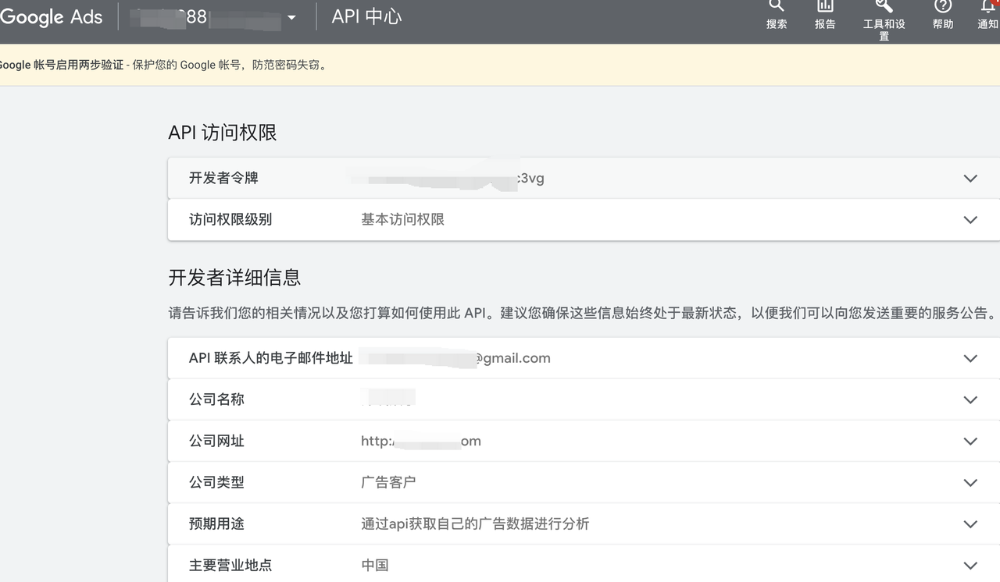
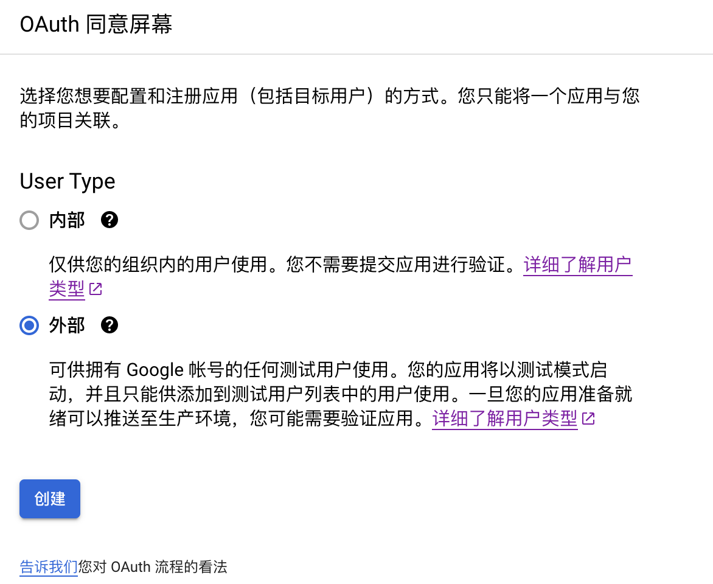
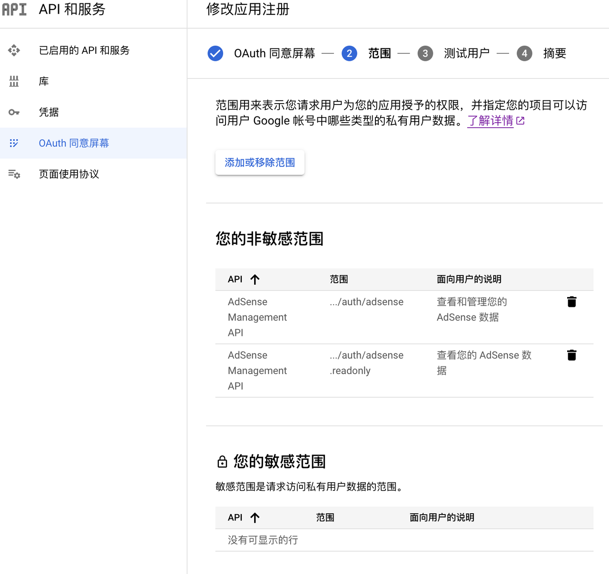
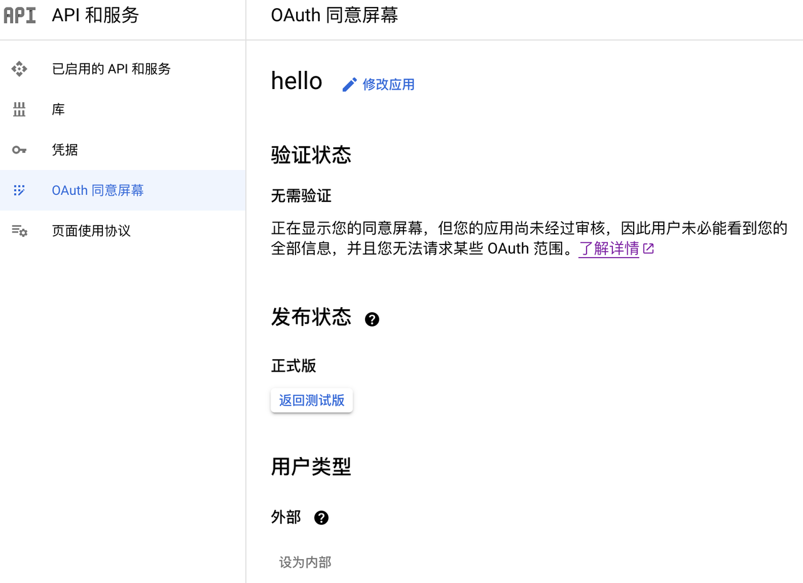
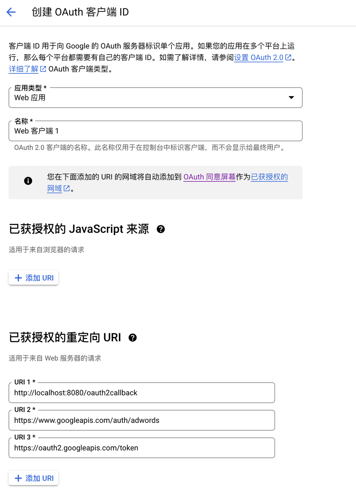
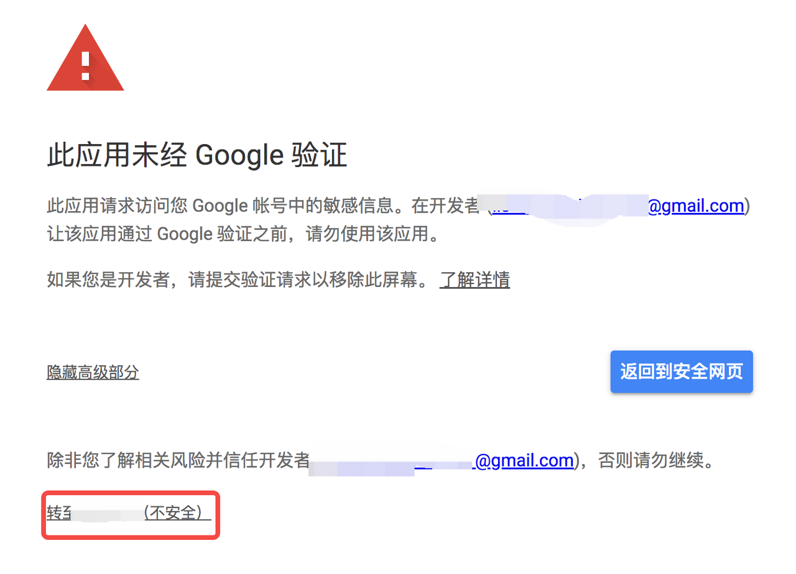
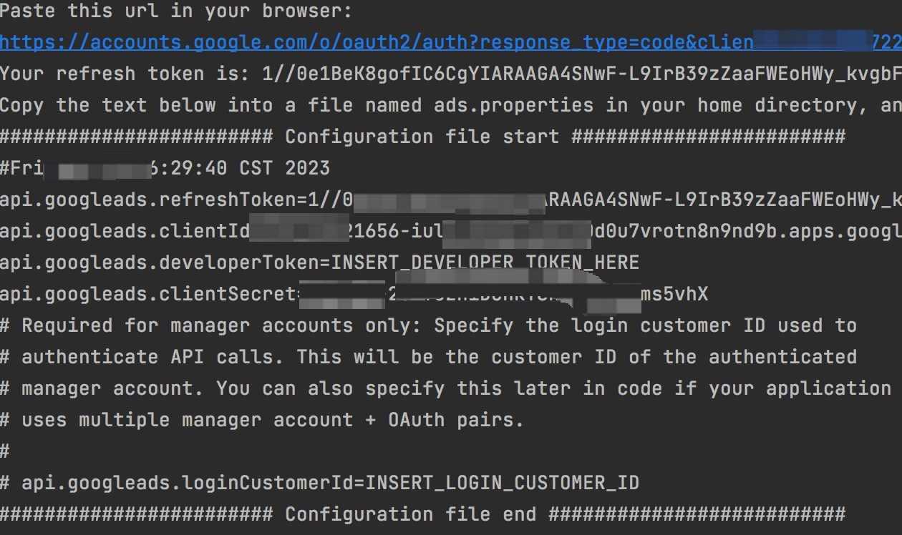
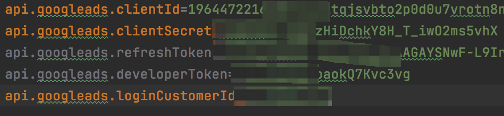
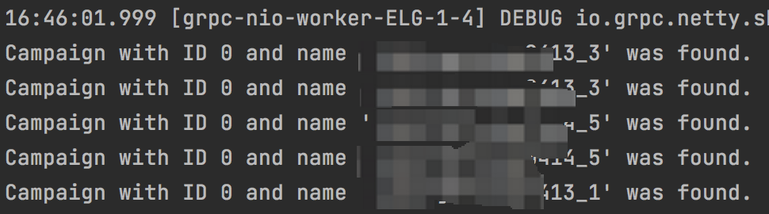

# **Google Ads API**

# **申请调试**

**文档入口**

https://developers.google.com/google-ads/api/docs/start

**api**** 调用申请步骤**

1. **申请开发者令牌**

1. 步骤说明：https://developers.google.com/google-ads/api/docs/first-call/overview?hl=zh-cn

通过申请人工审核后，访问权限级别为基本访问权限，开发者权限等级说明：https://developers.google.com/google-ads/api/docs/access-levels?hl=zh-cn)

申请需要资料：https://docs.google.com/document/d/1jZ6PFTukVcQrpAmKOD1f-QhLatJZgbd23lDvpIBM6\_0/edit

审核通过后，结果如下图所示：



2. **建立**** sdk ****用于授权**

步骤说明：https://developers.google.com/google-ads/api/docs/first-call/oauth-cloud-project?hl=zh-cn

1. 创建项目

1. 开启google ads API

1. 配置同意屏幕

1. 用户类型选择外部



1. 添加API范围，如果添加敏感范围API，需要人工审核验证，详细说明：https://developers.google.com/identity/protocols/oauth2/production-readiness/sensitive-scope-verification?hl=zh-cn，添加API如下图所示：



1. 保存后，点击发布应用按钮，更新为正式版本，结果如下图所示：



1. 创建凭据，保存后获取客户端id和客户端密钥，用于后面代码调试获取token。

注意重定向url添加，结果如下图所示：



3. **授权获取**** refresh\_token**

1. 下载依赖：

```XML
<dependency>
<groupId>com.google.api-ads</groupId>
<artifactId>google-ads</artifactId>
<version>25.0.0</version>
</dependency>
```

1. 获取代码：https://developers.google.com/google-ads/api/samples/generate-user-credentials

1. _对应凭据中填写的重定向__url_

1. _修改回调地址：__OAUTH2\_CALLBACK\_BASE\_URI_ = "http://localhost";

1. SimpleCallbackServer中端口改为8080

1. 代码中clientId填写凭据中的客户端id，clientSecret填写凭据中的客户端密钥

1. 启动代码，打印的地址用浏览器打开，如下图点击红框按钮，然后点击同意允许：



1. 最后在IDE中打印refresh\_code,如下图所示：



4. **通过**** refresh\_code ****调用**** api**

参考：https://developers.google.com/google-ads/api/docs/client-libs/java/getting-started，或者代码获取：_https://github.com/googleads/google-ads-java/blob/HEAD/google-ads-examples/src/main/java/com/google/ads/googleads/examples/basicoperations/GetCampaigns.java_

1. 填写信息如下：



1. 运行代码打印结果如下图（忽略警告信息Failed to load netty-tcnative; OpenSslEngine）：



**api**** 使用查询语言**

https://developers.google.com/google-ads/api/docs/query/overview?hl=zh-cn

google文档说明：

1. 获取等级账号：https://developers.google.com/google-ads/api/docs/account-management/get-account-hierarchy?hl=zh-cn

1. 获取广告数据：https://developers.google.com/google-ads/api/docs/reporting/example?hl=zh-cn

**警告忽略方案**

https://forum.search-guard.com/t/problem-with-openssl-netty-tcnative/1442
